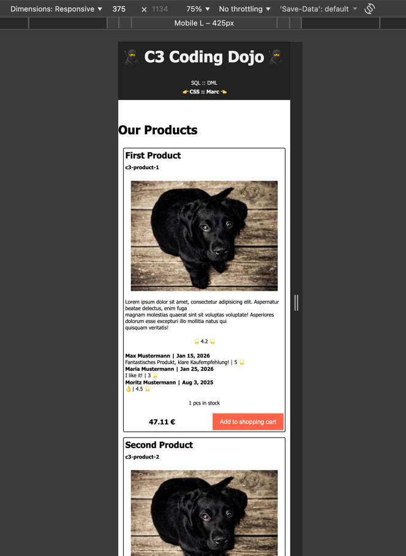
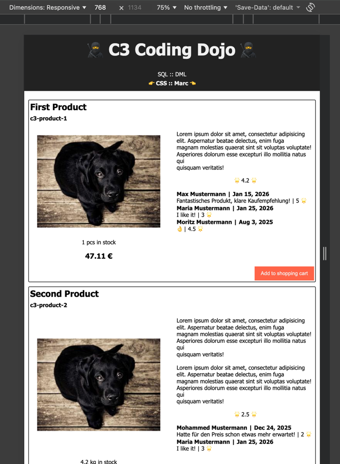
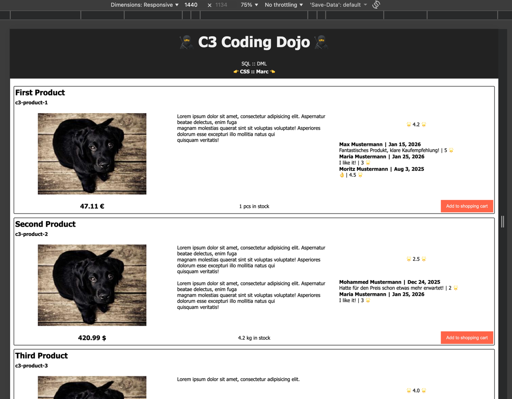

# Hintergrund

Seit Neuestem arbeitest Du mit Marc. Marc mag Marc und sonst eher niemanden - Dich hasst er aber ganz besonders. Klar, Du bist attraktiv, humorvoll und verdammt klug... wer will's ihm da verübeln.
Whatever. Marc will heute früher Feierabend machen, weil Mario Barth in der Stadt ist und lässt Dich auf die ihm ganz eigene Art wissen, dass Du leiden wirst, sollte jemand vom Stamme Pixelschubser das (HTML-) DOM von _c3-product-card_ berühren.

# Anforderungen

Zeig's Marc. Das Layout ist nicht trivial - aber mit etwas Wissen zu modernem CSS verwandelt sich Dein Editor zum Cape von Sir Flex-a-lot 👏🦸‍♂️👏.  Achte nur darauf, dass Anpassungen des Markup strengstens verboten sind.

Das UI muss responsiv sein und sich größtenteils an den Screenshots orientieren:

## Small (<= 640 Pixel)

## Medium (<= 1.024 Pixel) 

## Large: (> 1.024 Pixel)

# Tipps

Wie man an den Referenzen ablesen kann, geht es um das Grid-Layout - eine Art Gegenentwurf zum Flex-Layout, bei dem das Grid den Elementen (eher autoritär) eine Fläche zuweist, ohne groß darauf zu achten, was diese Bestandteile "wollen". Diese Zuweisungen können ganz generisch erfolgen (d.h. die Zellen des Grid werden auf Basis der Reihenfolge im DOM vergeben)... oder auch auf Basis von Bezeichnern. Diese Methodik hat sicher nicht nur Vorteile, erleichtert allerdings sehr die responsive Umgestaltung und ist meist gut lesbar.  

# Referenzen

* https://developer.mozilla.org/en-US/docs/Web/CSS/Reference/Properties/grid-area
* https://developer.mozilla.org/en-US/docs/Web/CSS/Reference/Properties/grid-template-areas
* https://developer.mozilla.org/en-US/docs/Web/CSS/Guides/Media_queries/Using
* https://developer.mozilla.org/en-US/docs/Web/CSS/Guides/Containment/Container_queries
